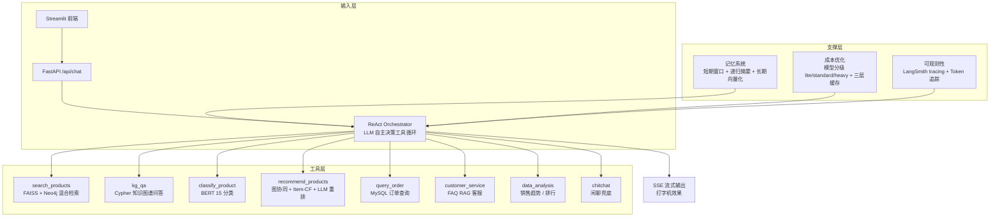

# 电商领域智能体 (E-Commerce Agent)


基于 LangGraph + ReAct Agent + 多工具架构的电商智能助手系统，支持商品搜索、知识图谱问答、商品分类、智能推荐、订单查询、客服 FAQ 等功能。

## v2.0 核心升级

| 升级项 | v1.0 | v2.0 |
|--------|------|------|
| **Agent 架构** | 固定路由 + 固定调用 | ReAct 工具循环 (LLM 自主决策) |
| **记忆系统** | 无 (每次请求独立) | 短期窗口 + 摘要 + 长期向量化记忆 |
| **流式输出** | 阻塞返回 | SSE 逐 token 流式 (打字机效果) |
| **RAG 评估** | 5 条 LLM-as-Judge | Recall@K / NDCG / 忠实度 全维度 |
| **可观测性** | print 日志 | LangSmith tracing + 结构化日志 + Token 追踪 |
| **成本优化** | 关键词路由 + TTL 缓存 | 模型分级(lite/standard/heavy) + Prompt 压缩 + L1/L2/L3 多级缓存(含语义缓存) |
| **推荐评估** | 无 | NDCG/MAP/CTR/CVR 离线评估 + 策略对比 |

## 技术栈

| 层面 | 技术 |
|------|------|
| 编排框架 | LangChain + LangGraph + ReAct Agent |
| LLM | DeepSeek Chat API (模型分级: lite/standard/heavy) |
| 嵌入模型 | BAAI/bge-base-zh-v1.5 (768d) |
| 向量存储 | FAISS + Neo4j 向量索引 |
| 图数据库 | Neo4j 5.26 Community |
| 业务数据库 | MySQL 8.0 (gmall) |
| 后端 | FastAPI + Uvicorn (SSE 流式) |
| 前端 | Streamlit (流式打字机) |
| 可观测性 | LangSmith + 结构化 JSON 日志 |
| 分类模型 | bert-base-chinese (15 分类) |

## 系统架构



### ReAct 工具循环

v2.0 的核心改进：LLM 不再被固定路由到单个 Agent，而是自主决定：
1. **调哪个工具** — LLM 根据用户意图选择最合适的工具
2. **观察结果** — 工具返回结果后 LLM 判断信息是否充分
3. **再决策** — 可以继续调用其他工具 (如先搜索 → 再分类 → 再推荐)
4. **最终回答** — 基于所有工具结果生成综合回答

### 记忆系统

- **短期记忆**: 滑动窗口保留最近 10 轮对话，超过 6 轮自动摘要
- **长期记忆**: LLM 提取关键事实 (用户偏好、购买决策)，向量化存储到 FAISS
- **上下文构建**: 每次请求注入长期记忆 + 短期摘要 + 最近对话

### 成本优化

- **模型分级**: 闲聊/简单FAQ → lite (deepseek-chat, 512 tokens)，搜索/KG QA → standard (deepseek-chat, 2048 tokens)，推荐/分析 → heavy (deepseek-reasoner R1, 4096 tokens)
- **Prompt 压缩**: 裁剪冗余空白、截断超长 context、压缩 JSON
- **多级缓存**: L1 内存 (TTL 5min) + L2 磁盘 (持久化) + L3 语义缓存 (Embedding 相似度匹配)，非闲聊结果自动缓存

## 技术决策与设计权衡

> 项目演进过程中的关键取舍，也是面试深挖的重点。每个决策都按「备选方案 → 选择 → 理由 → 代价」展开。

### 1. ReAct 工具循环 vs 固定路由

- **备选**: v1.0 的关键词路由 + 固定 Agent 调用
- **选择**: v2.0 以 ReAct（LLM 自主决策工具）为主，保留固定路由作为降级（`orchestration/graph.py`）
- **理由**: 真实用户意图组合多变（如"推荐预算 200 以内的蓝牙耳机"），固定路由无法覆盖；ReAct 支持链式调用（搜索 → 分类 → 推荐）
- **代价**: 多轮 LLM 推理带来额外延迟与 token 成本——通过模型分级、缓存、防死循环回调（`RepeatDetectionCallback`）控制

### 2. 模型分级（lite / standard / heavy）

- **备选**: 所有请求统一使用 deepseek-chat
- **选择**: 闲聊/FAQ → lite（512 tokens），搜索/KG 问答 → standard（2048），推荐/分析 → heavy（deepseek-reasoner R1，4096）
- **理由**: 简单任务用低成本模型，复杂任务才启用推理模型（成本约差 4 倍）
- **代价**: 需要按任务校准 prompt 与超参，路由误判会损失响应质量

### 3. 三层缓存（L1 内存 / L2 磁盘 / L3 语义）

- **备选**: 无缓存或单层 TTL 缓存
- **选择**: L1 内存（TTL 5min）+ L2 磁盘持久化 + L3 Embedding 语义缓存，非闲聊结果自动缓存
- **理由**: 相似问题重复提问时语义缓存直接命中，省掉整次 LLM 调用
- **代价**: 相似度阈值难调——阈值高命中率低，阈值低会误命中（语义相似但答案不同）

### 4. 记忆系统（短期窗口 + 递归摘要 + 长期向量化）

- **备选**: 无状态对话
- **选择**: 滑动窗口 10 轮 + 超过 6 轮自动递归摘要 + LLM 抽取关键事实向量化存储到 FAISS
- **理由**: 既支持多轮连续对话，又避免上下文无限膨胀
- **代价**: 摘要有信息损失，且摘要本身消耗 token；长期记忆质量依赖 Embedding 检索

### 5. 混合检索（FAISS 向量 + Neo4j 图谱）

- **备选**: 纯向量检索或纯关键词
- **选择**: FAISS 向量召回候选 + Neo4j 图谱补充关系（品牌/类目/属性），搜索与知识问答共用
- **理由**: 向量擅长语义相似，图谱擅长关系推理（如"Apple 有哪些产品"）
- **代价**: 两套索引需同步维护；Cypher 存在注入与查询复杂度风险——内置 Text2Cypher 安全校验与 MATCH 子句数量上限

### 6. 降级策略

- 分类模型未加载 → 规则关键词兜底
- ReAct 失败 → 固定路由编排器
- LLM 重排失败 → 返回原始召回结果
- 数据库不可用 → 明确提示而非静默失败

原则：任何单一组件故障都不能让整个系统不可用。

## 模型文件说明

> 大型模型文件超出 GitHub 单文件限制，**不随本仓库分发**，按以下方式获取：

| 模型 | 大小 | 获取方式 |
|------|------|---------|
| BERT 商品分类模型（`models/best/`） | ~390MB | 自行训练：`python scripts/train_classify_model.py`（训练数据由 `scripts/import_taobao_data.py` 从原始数据集生成，不随仓库分发；约 10 epochs 可达 acc 95.97% / macro-F1 95.84%） |
| BGE 中文嵌入模型（`BAAI/bge-base-zh-v1.5`） | ~400MB | 首次运行自动从 HuggingFace 下载；国内环境可在 `.env` 配置 `HF_ENDPOINT=https://hf-mirror.com` |
| FAISS 索引（`data/faiss_index/`） | ~18MB | 已随仓库分发；如需重建：`python scripts/build_faiss_index.py` + `python scripts/build_faq_index.py` |

未加载分类模型时，classify Agent 会自动降级到规则关键词兜底方案，不影响系统运行。

## 快速开始

### 方式一：Docker 部署（推荐）

```bash
# 1. 配置环境变量
cp .env.example .env
# 编辑填入 DeepSeek API Key、Neo4j 密码等

# 2. 一键启动
docker compose up -d

# 3. 生成并导入数据（首次；原始数据与导入脚本不随仓库分发）
#    有淘宝原始数据集时，先执行: python scripts/import_taobao_data.py
docker compose exec -T neo4j cypher-shell -u neo4j -p <password> \
  < data/processed/neo4j_import.cypher
#    导入 MySQL（可选，同上先生成 mysql_gmall.sql 后执行）:
docker compose exec -T mysql mysql -u root -p<password> gmall \
  < data/processed/mysql_gmall.sql

# 4. 访问
# 前端: http://localhost:8501
# API:  http://localhost:8002/docs
```

### 方式二：本地开发

```bash
# 1. 创建虚拟环境
python3 -m venv venv
source venv/bin/activate    # Linux
# venv\Scripts\activate     # Windows

# 2. 安装依赖
pip install -r requirements.txt

# 3. 配置环境变量
cp .env.example .env

# 4. 启动 Neo4j 和 MySQL

# 5. 构建索引（需先运行 scripts/import_taobao_data.py 生成数据）
python scripts/build_faiss_index.py
python scripts/build_faq_index.py

# 6. 启动服务
bash scripts/start.sh                          # API 后端
streamlit run frontend/streamlit_app.py --server.port 8501  # 前端
```

## API 接口

| 方法 | 路径 | 说明 |
|------|------|------|
| POST | /api/chat | 统一对话入口（ReAct + 记忆系统） |
| POST | /api/chat/stream | **流式对话入口 (SSE 逐 token)** |
| POST | /api/classify | 独立商品分类 |
| POST | /api/search | 独立商品搜索 |
| GET | /api/agents | 查看已注册 Agent 列表 |
| GET | /api/health | 健康检查 |
| GET | /api/stats | **系统统计 (Token/缓存/记忆)** |
| GET | /api/trace | **获取追踪树** |
| DELETE | /api/session/{id} | **清除会话记忆** |

### 流式对话示例

```bash
curl -X POST http://localhost:8002/api/chat/stream \
  -H "Content-Type: application/json" \
  -d '{"message":"搜索蓝牙耳机","session_id":"test123"}' \
  --no-buffer
```

## 评估系统

> 离线评估覆盖检索、排序、生成质量与成本，脚本见 `tests/`。CI 同时保证代码质量与单元测试通过。

### 已有结果

| 任务 | 指标 | 结果 | 复现方式 |
|------|------|------|----------|
| 商品分类 | Accuracy | 95.97% | `python scripts/train_classify_model.py`（约 10 epochs） |
| 商品分类 | Macro-F1 | 95.84% | 同上（15 分类） |
| RAG 检索/生成 | Recall@1/3/5、NDCG@5、Faithfulness 等 | 待回填 | `python tests/rag_evaluation.py`（需 Neo4j/FAISS 就绪） |
| 推荐排序 | NDCG@5/10、MAP@5/10、CTR@K | 待回填 | `python tests/recommendation_eval.py`（需 MySQL/图数据就绪） |

### RAG 评估

```bash
python tests/rag_evaluation.py
```

评估指标:
- **检索**: Recall@1/3/5, Precision@5, MRR, NDCG@5, Hit Rate@5
- **生成**: Faithfulness, Answer Relevance, Context Precision/Recall
- **性能**: 延迟、Token 消耗

### 推荐评估

```bash
python tests/recommendation_eval.py
```

评估指标:
- **排序**: NDCG@5/10, MAP@5/10, MRR, Hit Rate@5/10
- **多样性**: Coverage, Intra-list Diversity, Novelty
- **模拟**: CTR@K, CVR@K
- **策略对比**: graph_only vs graph+LLM_rerank (Δ NDCG)

### LLM as Judge 评估

```bash
python tests/evaluate.py
```

## 环境变量

| 变量 | 默认值 | 说明 |
|------|--------|------|
| `REACT_ENABLED` | true | 启用 ReAct 工具循环 |
| `STREAMING_ENABLED` | true | 启用流式输出 |
| `MEMORY_LONG_TERM_ENABLED` | true | 启用长期记忆 |
| `MEMORY_WINDOW` | 10 | 短期记忆窗口大小 |
| `TRACING_ENABLED` | false | 启用 LangSmith tracing |
| `LANGSMITH_API_KEY` | | LangSmith API Key |
| `LITE_MODEL` | deepseek-chat | 简单任务使用的模型 |

## 项目结构

```
ecommerce-agent/
├── api/
│   └── app.py                   # FastAPI API (含 SSE 流式端点)
├── agents/
│   ├── tools/base.py            # 工具基类
│   ├── search_agent.py          # 商品搜索 Agent
│   ├── kg_qa_agent.py           # 知识图谱问答 Agent
│   ├── classify_agent.py        # 商品分类 Agent
│   ├── recommend_agent.py       # 推荐 Agent
│   ├── order_agent.py           # 订单 Agent
│   ├── cs_agent.py              # 客服 Agent
│   ├── analytics_agent.py       # 数据分析 Agent
│   └── chitchat_agent.py        # 闲聊 Agent
├── orchestration/
│   ├── router.py                # 意图路由器
│   ├── graph.py                 # 固定路由编排器 (降级方案)
│   ├── react_orchestrator.py    # ★ ReAct 工具循环编排器
│   ├── memory.py                # ★ 记忆系统 (短期+长期)
│   ├── model_router.py          # ★ 成本优化 (模型分级+缓存)
│   ├── observability.py         # ★ 可观测性 (tracing+日志+token)
│   └── registry.py              # Agent 注册中心
├── frontend/
│   └── streamlit_app.py         # Streamlit UI (支持流式)
├── config/
│   └── settings.py              # 统一配置
├── tests/
│   ├── rag_evaluation.py        # ★ RAG 评估体系
│   ├── recommendation_eval.py   # ★ 推荐离线评估
│   ├── evaluate.py              # LLM as Judge 评估
│   └── test_agents.py           # Agent 单元测试
├── data/
│   ├── faiss_index/             # FAISS 索引
│   ├── memory_store/            # ★ 记忆持久化存储
│   ├── cache/                   # ★ 磁盘缓存
│   └── processed/               # 数据产物（gitignored，由脚本生成）
├── scripts/
├── requirements.txt
├── docker-compose.yml
└── README.md
```

## License

MIT License，详见 [LICENSE](LICENSE)。
